# Omarchy themes for Ghostty

All 22 themes from [Omarchy](https://github.com/omacom/omarchy) ported to the [Ghostty](https://ghostty.org) terminal, for macOS and Linux.

The colors are generated straight from each Omarchy theme's `colors.toml` using Omarchy's own Ghostty template, so you get exactly what Omarchy itself writes for Ghostty: background, foreground, cursor, selection and the full 16-color ANSI palette.

On macOS, each theme also recolors **Ghostty's app icon** and the **split divider** to match, so switching theme changes the Dock icon too ([details](#matching-app-icon)).

## Quick install

```sh
curl -fsSL https://raw.githubusercontent.com/Mr-Sunglasses/ghostty-omarchy-themes/main/install.sh | bash
```

Then pick a theme ([screenshots](#screenshots)) in your Ghostty config (`~/.config/ghostty/config`):

```
theme = Omarchy Tokyo Night
```

Reload Ghostty with <kbd>Cmd</kbd>+<kbd>Shift</kbd>+<kbd>,</kbd> (macOS) or <kbd>Ctrl</kbd>+<kbd>Shift</kbd>+<kbd>,</kbd> (Linux).

### Other ways to install

From a clone:

```sh
git clone https://github.com/Mr-Sunglasses/ghostty-omarchy-themes
cd ghostty-omarchy-themes
./install.sh
```

Or manually: copy the files in [`themes/`](themes) into `~/.config/ghostty/themes/`.

### Tips

Follow your system's light/dark appearance:

```
theme = light:Omarchy Catppuccin Latte,dark:Omarchy Catppuccin Mocha
```

Browse every installed theme with a live preview:

```sh
ghostty +list-themes
```

## Themes

| Theme | Mode | Config | Palette & icon colors |
|---|---|---|---|
| Catppuccin Latte | Light | `theme = Omarchy Catppuccin Latte` | 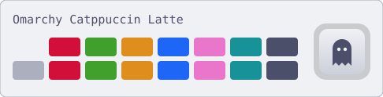 |
| Catppuccin Mocha | Dark | `theme = Omarchy Catppuccin Mocha` | 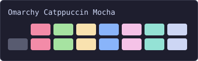 |
| Ethereal | Dark | `theme = Omarchy Ethereal` | 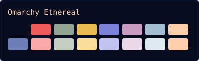 |
| Everforest | Dark | `theme = Omarchy Everforest` | 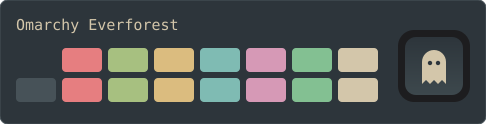 |
| Flexoki Light | Light | `theme = Omarchy Flexoki Light` | 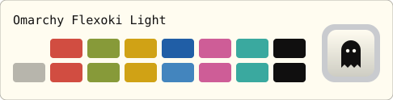 |
| Gruvbox | Dark | `theme = Omarchy Gruvbox` | 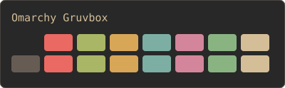 |
| Hackerman | Dark | `theme = Omarchy Hackerman` | 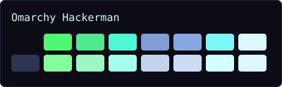 |
| Kanagawa | Dark | `theme = Omarchy Kanagawa` | 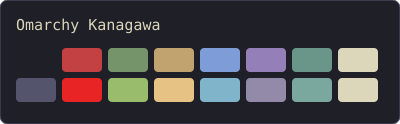 |
| Last Horizon | Dark | `theme = Omarchy Last Horizon` | 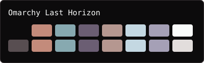 |
| Lumon | Dark | `theme = Omarchy Lumon` | 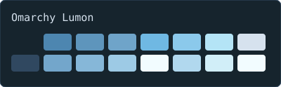 |
| Lupine | Light | `theme = Omarchy Lupine` | 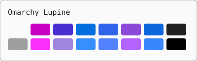 |
| Matte Black | Dark | `theme = Omarchy Matte Black` | 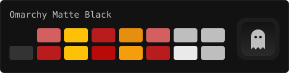 |
| Miasma | Dark | `theme = Omarchy Miasma` | 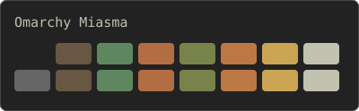 |
| Nord | Dark | `theme = Omarchy Nord` | 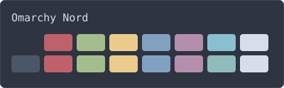 |
| Osaka Jade | Dark | `theme = Omarchy Osaka Jade` | 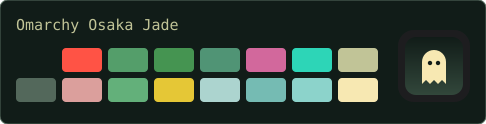 |
| Retro 82 | Dark | `theme = Omarchy Retro 82` | 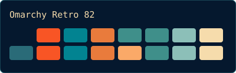 |
| Ristretto | Dark | `theme = Omarchy Ristretto` | 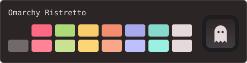 |
| Rose Pine Dawn | Light | `theme = Omarchy Rose Pine Dawn` | 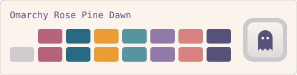 |
| Solitude | Dark | `theme = Omarchy Solitude` | 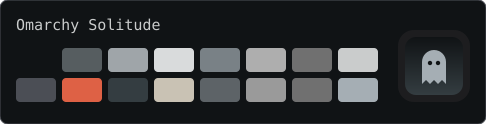 |
| Tokyo Night | Dark | `theme = Omarchy Tokyo Night` | 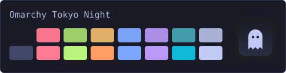 |
| Vantablack | Dark | `theme = Omarchy Vantablack` | 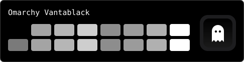 |
| White | Light | `theme = Omarchy White` | 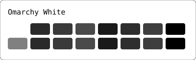 |

## Screenshots

Each theme applied in Ghostty on macOS (default font, `ls`, `git` output, some code and the 16-color palette).

<table>
<tr>
<td align="center"><b>Catppuccin Latte</b><br></td>
<td align="center"><b>Catppuccin Mocha</b><br></td>
</tr>
<tr>
<td align="center"><b>Ethereal</b><br></td>
<td align="center"><b>Everforest</b><br></td>
</tr>
<tr>
<td align="center"><b>Flexoki Light</b><br></td>
<td align="center"><b>Gruvbox</b><br></td>
</tr>
<tr>
<td align="center"><b>Hackerman</b><br></td>
<td align="center"><b>Kanagawa</b><br></td>
</tr>
<tr>
<td align="center"><b>Last Horizon</b><br></td>
<td align="center"><b>Lumon</b><br></td>
</tr>
<tr>
<td align="center"><b>Lupine</b><br></td>
<td align="center"><b>Matte Black</b><br></td>
</tr>
<tr>
<td align="center"><b>Miasma</b><br></td>
<td align="center"><b>Nord</b><br></td>
</tr>
<tr>
<td align="center"><b>Osaka Jade</b><br></td>
<td align="center"><b>Retro 82</b><br></td>
</tr>
<tr>
<td align="center"><b>Ristretto</b><br></td>
<td align="center"><b>Rose Pine Dawn</b><br></td>
</tr>
<tr>
<td align="center"><b>Solitude</b><br></td>
<td align="center"><b>Tokyo Night</b><br></td>
</tr>
<tr>
<td align="center"><b>Vantablack</b><br></td>
<td align="center"><b>White</b><br></td>
</tr>
</table>

## Matching app icon

Every theme file sets Ghostty's `custom-style` app icon in the theme's colors, along with a matching split divider:

```
macos-icon = custom-style
macos-icon-frame = plastic                    # aluminum for light themes
macos-icon-ghost-color = <cursor color>
macos-icon-screen-color = <background>,<selection>
split-divider-color = <accent>
```

Change `theme` in your config, restart Ghostty, and the Dock icon follows. The icon swatches in the table above are simplified previews of these colors; Ghostty draws the actual icon.

**Opting out:** anything in your own config takes precedence over the theme, so to keep the standard icon add:

```
macos-icon = official
```

Notes:

- The `macos-icon-*` settings only apply on macOS. The split divider color works everywhere.
- Ghostty marks `custom-style` as experimental, so a future Ghostty release may change how it looks.
- Remove any `macos-icon*` or `split-divider-color` lines from your own config if you want the theme to control them.
- Icon changes need a full restart of Ghostty (quit and reopen), not just a config reload.

## Regenerating from upstream

[`generate.py`](generate.py) (Python 3.11+, no dependencies) rebuilds `themes/` and `previews/` (including the icon colors) from the latest Omarchy. It resolves each palette with the same fallback rules as Omarchy's `omarchy-theme-color` and renders Omarchy's `default/themed/ghostty.conf.tpl`, so new themes and template changes upstream are picked up automatically.

```sh
./generate.py                 # clones omarchy into a temp dir
./generate.py ~/src/omarchy   # or use an existing checkout
```

On macOS, [`screenshots.sh`](screenshots.sh) retakes the terminal screenshots by opening Ghostty with each theme and capturing the window (needs Screen Recording permission for your terminal):

```sh
./screenshots.sh                 # all themes
./screenshots.sh "Tokyo Night"   # just one
```

## Credits

Theme palettes are from [Omarchy](https://github.com/omacom/omarchy) by David Heinemeier Hansson and its contributors, and from the original theme authors (Catppuccin, Tokyo Night, Rosé Pine, Nord, Gruvbox, Everforest, Kanagawa, Flexoki and others). Released under the [MIT License](LICENSE).
